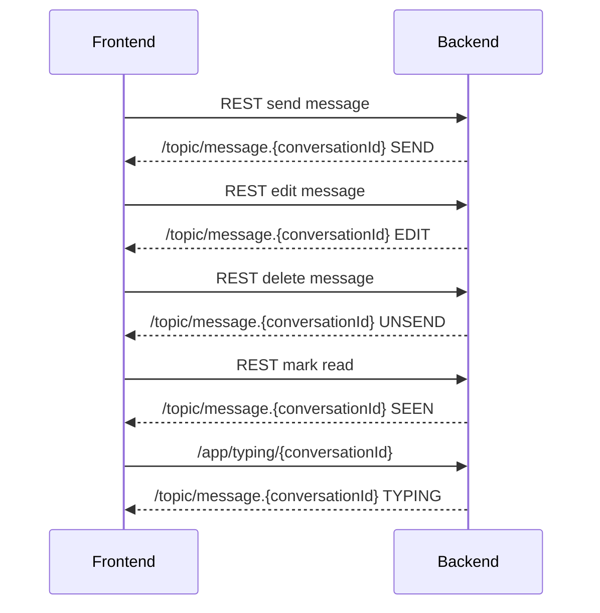

# VNUGuideApp

## Chat Integration (Vietnamese / English)

### Tổng quan / Overview
- Base REST URL: `/api/v1`
- Auth (HTTP): `Authorization: Bearer <access_token>`
- WebSocket endpoint: `/ws`
- STOMP prefixes:
  - Publish: `/app`
  - Subscribe: `/topic/*`, `/user/queue/*`
  - User destination prefix: `/user`

### WebSocket/STOMP (events chỉ nhận, gửi bằng REST)
Backend hiện tại dùng REST để gửi tin nhắn, WebSocket chỉ để nhận event realtime.

**Connect headers**
```
Authorization: Bearer <access_token>
```

**Subscribe topics**
- `/topic/message.{conversationId}`: message events (SEND, EDIT, UNSEND, SEEN, TYPING)
- `/topic/channel.{conversationId}`: channel update events (CHANNEL_CHANGED)
- `/user/queue/join-conversation`: join request events

**Send typing**
- Destination: `/app/typing/{conversationId}`
- Payload:
```
{
  "conversationId": "string",
  "isTyping": true
}
```

**MessageEvent envelope**
```
{
  "eventType": "SEND",
  "data": { ... }
}
```

**Event types**
`SEND`, `EDIT`, `UNSEND`, `SEEN`, `TYPING`, `SEND_JOIN_REQUEST`, `ACCEPT_JOIN_REQUEST`, `REJECT_JOIN_REQUEST`, `CHANNEL_CHANGED`

### REST APIs (Chat)

#### Channels
**Create channel**
- `POST /api/v1/channels` (multipart/form-data)
- Fields:
  - `name` (string, required)
  - `description` (string, optional)
  - `privacy` (PUBLIC|PRIVATE, optional)
  - `channelType` (TEXT|VOICE|VIDEO|ANNOUNCEMENT, optional)
  - `participantIds` (JSON array string, optional)
  - `avatar` (file, optional)

**Update channel (ADMIN)**
- `PATCH /api/v1/channels/{channelId}` (multipart/form-data)
- Fields: `name`, `description`, `avatar`

**Get channel by id**
- `GET /api/v1/channels/{channelId}`

**Get channel by conversation**
- `GET /api/v1/channels/conversation/{conversationId}`

**Members**
- `GET /api/v1/channels/{channelId}/members`
- `POST /api/v1/channels/{channelId}/members` body:
```
{
  "userIds": [1, 2, 3]
}
```
- `DELETE /api/v1/channels/{channelId}/members/{memberId}`

**Join requests (ADMIN)**
- `GET /api/v1/channels/{channelId}/join-requests`

#### Conversations
**Create private conversation**
- `POST /api/v1/conversations/create`
```
{
  "receiverId": 123
}
```

**List private conversations**
- `GET /api/v1/conversations/private?page=0&size=10`

**List channel conversations**
- `GET /api/v1/conversations/channels?page=0&size=10`

**Leave conversation**
- `DELETE /api/v1/conversations/delete-conversation/{conversationId}`

**Get conversation media**
- `GET /api/v1/conversations/{conversationId}/media?fileType=IMAGE`

#### Join conversation (private channel)
**Send join request**
- `POST /api/v1/conversations/join/{conversationId}`

**Accept join request (ADMIN)**
- `POST /api/v1/conversations/join/accept/{joinRequestId}`

**Reject join request (ADMIN)**
- `PATCH /api/v1/conversations/join/reject/{joinRequestId}`

#### Messages
**Send text message**
- `POST /api/v1/messages/send`
```
{
  "content": "hello",
  "replyToId": 0,
  "ConversationId": "string"
}
```

**Send message with files**
- `POST /api/v1/messages/upload-file` (multipart/form-data)
- Fields:
  - `files` (multiple files, required, each <= 20MB)
  - `conversationId` (string, required)
  - `content` (string, optional)
  - `replyToId` (long, optional)

**Get messages by conversation**
- `GET /api/v1/messages?conversationId=...&page=0&size=10`

**Delete message**
- `DELETE /api/v1/messages/{messageId}`

**Edit message**
- `PUT /api/v1/messages/{messageId}`
- Body: raw string (new content)

**Mark read**
- `POST /api/v1/messages/mark-read`
```
{
  "conversationId": "string",
  "messageId": 123
}
```

**Search in conversation**
- `GET /api/v1/messages/search?conversationId=...&keyword=...&page=0&size=20`

### DTO Schemas (for frontend typing)

**ChannelResponse**
```
{
  "id": 1,
  "name": "string",
  "description": "string",
  "privacy": "PUBLIC",
  "channelType": "TEXT",
  "avatarUrl": "string",
  "conversationId": "string",
  "creatorId": 1,
  "memberCount": 10,
  "createdAt": "2026-01-20T10:00:00"
}
```

**ChannelMemberResponse**
```
{
  "userId": 1,
  "userName": "string",
  "avatarUrl": "string",
  "role": "ADMIN",
  "joinedAt": "2026-01-20T10:00:00"
}
```

**ConversationResponse**
```
{
  "id": "string",
  "name": "string",
  "avatarUrl": "string",
  "unreadCount": 0,
  "lastMessage": "string",
  "lastMessageTime": "2026-01-20T10:00:00"
}
```

**MessageResponse**
```
{
  "id": 1,
  "senderId": 2,
  "conversationId": "string",
  "senderName": "string",
  "senderAvatarUrl": "string",
  "content": "string",
  "messageType": "TEXT",
  "readBy": [
    {
      "userId": 3,
      "fullName": "string",
      "avatarUrl": "string"
    }
  ],
  "isActive": true,
  "replyToId": 10,
  "timestamp": "2026-01-20T10:00:00"
}
```

**FileMessageResponse**
```
{
  "id": 1,
  "senderId": 2,
  "conversationId": "string",
  "senderName": "string",
  "senderAvatarUrl": "string",
  "content": "string",
  "fileUrls": ["https://..."],
  "messageType": "IMAGE",
  "readBy": [],
  "isActive": true,
  "replyToId": 10,
  "timestamp": "2026-01-20T10:00:00"
}
```

**JoinConversationResponse**
```
{
  "id": 1,
  "conversationId": "string",
  "userId": 2,
  "status": "PENDING",
  "createdAt": "2026-01-20T10:00:00"
}
```

**MediaAttachmentResponse**
```
{
  "id": 1,
  "messageId": 10,
  "fileId": 20,
  "fileUrl": "https://...",
  "fileType": "IMAGE",
  "fileSize": 12345,
  "uploadedAt": "2026-01-20T10:00:00"
}
```

**MessageReadEvent (SEEN)**
```
{
  "userId": 2,
  "lastReadMessageId": 99
}
```

**TypingEvent (TYPING)**
```
{
  "userId": 2,
  "userName": "string",
  "conversationId": "string",
  "isTyping": true
}
```

### Enums
- `ChannelPrivacy`: `PUBLIC`, `PRIVATE`
- `ChannelType`: `TEXT`, `VOICE`, `VIDEO`, `ANNOUNCEMENT`
- `MessageType`: `TEXT`, `IMAGE`, `VIDEO`, `AUDIO`, `DOCUMENT`, `SHARED_POST`
- `FileType`: `IMAGE`, `VIDEO`, `AUDIO`, `DOCUMENT`
- `JoinRequestStatus`: `PENDING`, `ACCEPTED`, `REJECTED`
- `ParticipantRole`: `ADMIN`, `MEMBER`

### Flow mẫu / Sample flows

**Send message flow**
1. REST `POST /api/v1/messages/send`
2. WS event on `/topic/message.{conversationId}` with `eventType=SEND`

**Edit/Unsend**
1. REST `PUT /api/v1/messages/{messageId}` or `DELETE /api/v1/messages/{messageId}`
2. WS event on `/topic/message.{conversationId}` with `EDIT` or `UNSEND`

**Read receipts**
1. REST `GET /api/v1/messages` or `POST /api/v1/messages/mark-read`
2. WS event on `/topic/message.{conversationId}` with `SEEN`

**Typing**
1. WS send `/app/typing/{conversationId}` with TypingEvent
2. WS event on `/topic/message.{conversationId}` with `TYPING`

**Join request**
1. REST `POST /api/v1/conversations/join/{conversationId}`
2. ADMIN receives `/user/queue/join-conversation` with `SEND_JOIN_REQUEST`
3. ADMIN accepts/rejects via REST
4. Requester receives `/user/queue/join-conversation` with `ACCEPT_JOIN_REQUEST` or `REJECT_JOIN_REQUEST`

### Mermaid sequence (WebSocket events)


---

### English Notes
Everything above is bilingual; use the same endpoints and payloads. The WebSocket channel is event-only, while message creation and file upload are REST. Subscribe to `/topic/message.{conversationId}` to receive all chat-related realtime events.